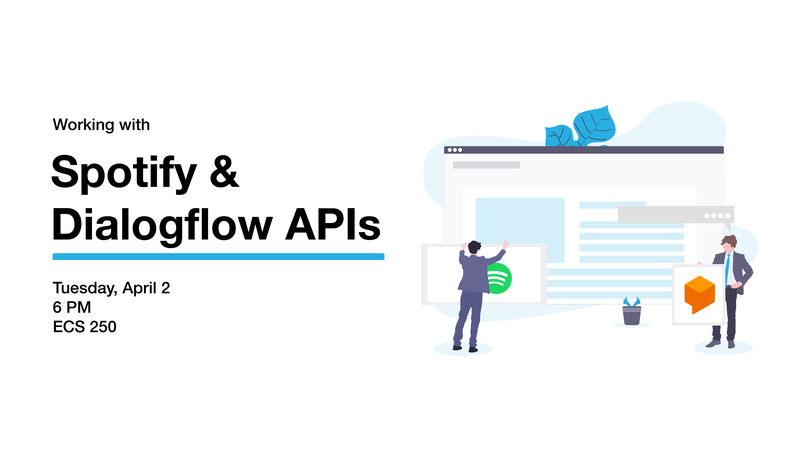

Workshop banner by Palak Verma

## Overview :airplane:
This is the source code for a workshop hosted by the [UVic Web Development Club](https://www.facebook.com/UVicWebDev/), originally prepared by Juan Carlos Gallegos (@okjuan).

At a high-level, our app is composed of a Python server and a JS/HTML/CSS client. The workshop is divided into several parts that build on each other incrementally; throughout, we make use the Spotify and Dialogflow APIs to develop our app's functionality.
* Part 1: We search Spotify via an API call to find music based on user input.
* Part 2: We query an existing Dialogflow agent via an API call for processing a user's natural language input.
* Part 3: We create our own Dialogflow agent.
* Part 4: We configure our new Dialogflow agent to talk to our own Python server to retrieve info for responding to the user.

### Part :one:
Your starting point:
* A minimal web client containing a Spotify widget and a minimal Python server.
    * The given server is meant to run (locally) and serves a *Spotify bearer token*
    * The client fetches the bearer token from the server, which it needs to make requests to the Spotify Web API

:bulb: **Your task:** :bulb:
* Make an HTTP GET request to the [Spotify Web API](https://developer.spotify.com/documentation/web-api/) to get the Spotify URI for the song entered by the user

### Part :two:
Your starting point:
* A minimal web client containing a Spotify widget and a Dialogflow chat agent widget.
    * The agent recognizes two types of messages: greetings and questions about an artist's top song. Unfortunately, it's music knowledge is quite limited -- we fix that in parts 3 and 4.

:bulb: **Your task:** :bulb:
* Instead of using Dialogflow widget, call the Dialogflow API yourself.
    * See the README in `part2/` for more info.

### Part :three:
:bulb: **Your task:** :bulb:
* Create your own Dialogflow agent.
* Adapt your solution from part 2 to talk to your own agent.

### Part :four:
Your starting point:
* We use our client code from part 3, but we add the Python server back in.
    * The server is similar to the one in part1, but has a new endpoint to talk to our Dialogflow agent from part3.

:bulb: **Your task:** :bulb:
* Following the give example, create a new endpoint in our Python server to answer our Dialogflow agent's question about an artist's top songs.
    * We use a minimal Spotify client on the server-side to get information about artists.

## Acknowledgements :pray:
While putting this workshop together, I used a bunch of online resources including:
* [W3 Schools](https://www.w3schools.com/)
* [Mozilla MDN Docs](https://developer.mozilla.org/)
* [Stack Overflow](https://stackoverflow.com/)
* [Dialogflow Docs](https://dialogflow.com/docs/)
* [Spotify Developer Docs](https://developer.spotify.com/documentation/)
* [Flask Assistant Docs](https://flask-assistant.readthedocs.io/en/latest/)

And specific tutorials including:
* [Dialogflow V1 API tutorial by Patrick Catanzariti](https://www.sitepoint.com/how-to-build-your-own-ai-assistant-using-api-ai/)
* [Adding iframe with jQuery](https://stackoverflow.com/questions/8179703/how-to-create-an-iframe-using-jquery-and-display-on-page)
